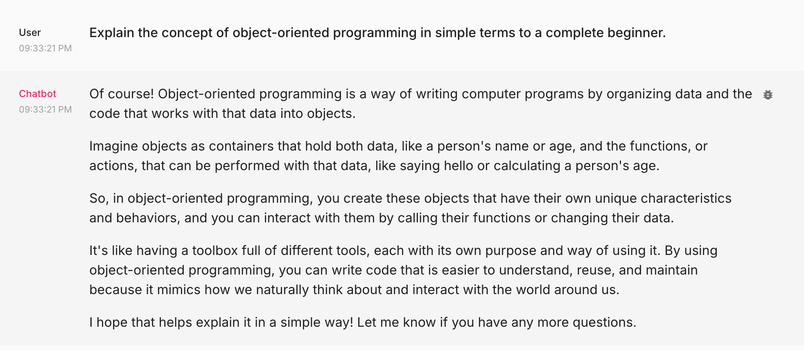
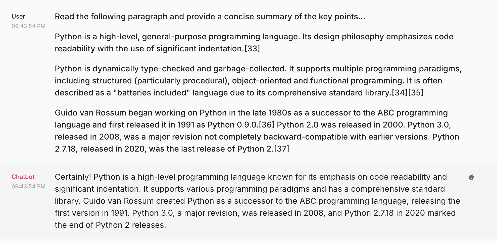
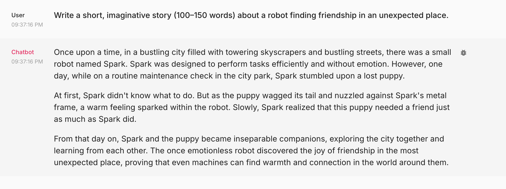
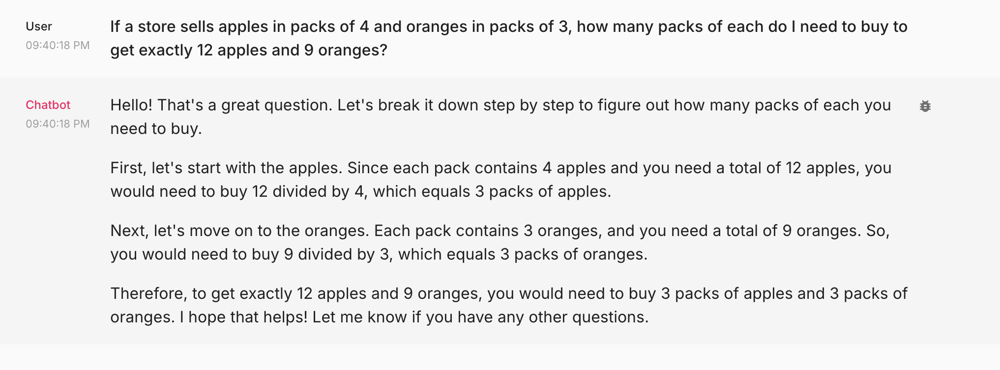
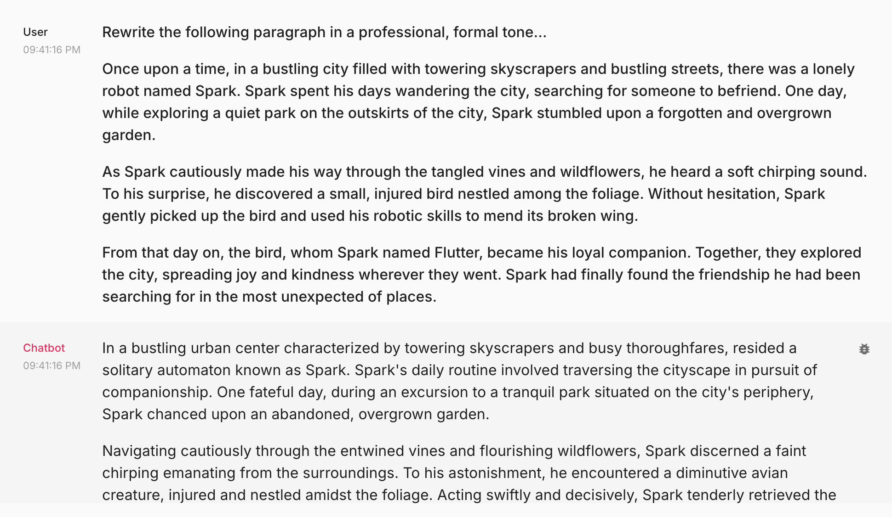

<h1 align="center" id="heading">Session 1: Introduction and Vibe Check</h1>

### [Quicklinks](https://github.com/AI-Maker-Space/AIE5/00_AIM_Quicklinks)

| 🤓 Pre-work | 📰 Session Sheet | ⏺️ Recording     | 🖼️ Slides        | 👨‍💻 Repo         | 📝 Homework      | 📁 Feedback       |
|:-----------------|:-----------------|:-----------------|:-----------------|:-----------------|:-----------------|:-----------------|
| [Session 1: Pre-Work](https://www.notion.so/The-AI-Engineering-Bootcamp-Cohort-5-Home-Page-175cd547af3d80969151ebc75bb1d94a?pvs=4#175cd547af3d8159907cf0ac05eb9050)| [Session 1: Introduction and Vibe Check](https://www.notion.so/Session-1-Introduction-and-Vibe-Check-177cd547af3d804d9ec7c0266889f947) | [Recording](https://us02web.zoom.us/rec/share/pNtF3s7dsxOnsDxMALes9o1yPSc0PfHr8rS7aVZSsDKqA9RysEhfzEi57ahT0F_R.eOIPyhx8A9e58B57) (ub?4jfUD) | [Session 1: Cohort Kickoff](https://www.canva.com/design/DAGcIeKKtHE/t9TVvikxC3EUetoqY1YoKA/edit?utm_content=DAGcIeKKtHE&utm_campaign=designshare&utm_medium=link2&utm_source=sharebutton) | [Session 1: Introduction and Vibe Check](https://github.com/AI-Maker-Space/AIE5/tree/main/01_Prompt%20Engineering%20and%20Prototyping%20Best%20Practices)| [Session 1 Assignment: Vibe Check](https://forms.gle/4VVx9rGrK9gqcZ8S9)| [AIE5 Feedback 1/14](https://forms.gle/7nfaP5ngje3HDKjV9)

### Assignment

In the following assignment, you are required to take the app that you created for the AIE5 challenge (from [this repository](https://github.com/AI-Maker-Space/Beyond-ChatGPT)) and conduct what is known, colloquially, as a "vibe check" on the application. 

You will be required to submit a link to your GitHub, as well as screenshots of the completed "vibe checks" through the provided Google Form!

> NOTE: This will require you to make updates to your personal class repository, instructions on that process can be found [here](https://github.com/AI-Maker-Space/AIE5/00_Setting Up Git/README.md)!

#### How AIM Does Assignments
Throughout our time together - we'll be providing a number of assignments. Each assignment can be split into two broad categories:

- Base Assignment - a more conceptual and theory based assignment focused on locking in specific key concepts and learnings.
- Hardmode Assignment - a more programming focused assignment focused on core code-concepts.

Each assignment will have a few of the following categories of exercises:

- ❓Questions - these will be questions that you will be expected to gather the answer to! These can appear as general questions, or questions meant to spark a discussion in your breakout rooms!
- 🏗️ Activities - these will be work or coding activities meant to reinforce specific concepts or theory components.
- 🚧 Advanced Builds - these will only appear in Hardmode assignments, and will require you to build something with little to no help outside of documentation!

##### 🏗️ Activity #1:

Please evaluate your system on the following questions:

1. Explain the concept of object-oriented programming in simple terms to a complete beginner. 
    - Aspect Tested: **Knowledge (we're asking for a specific factual statement)**
    - AI Response: 
    - "Vibe Check": Not terrible. Nothing in it is particularly wrong, although style-wise I feel like the response is a little bit more verbose than I'd like.
2. Read the following paragraph and provide a concise summary of the key points…
    - Aspect Tested: **Summarization**
    - AI Response: 
    - "Vibe Check": It did pretty well! Generally, LLMs out of the box seem pretty good at taking a block of text and shortening it.
3. Write a short, imaginative story (100–150 words) about a robot finding friendship in an unexpected place.
    - Aspect Tested: **Generation/Creativity (asking new text to be created that doesn't exist in the world yet, per se)**
    - AI Response: 
    - "Vibe Check": Didn't respect the word count (which isn't too surprising considering LLMs work at the level of tokens rather than words).
4. If a store sells apples in packs of 4 and oranges in packs of 3, how many packs of each do I need to buy to get exactly 12 apples and 9 oranges?
    - Aspect Tested: **Mathematical Reasoning**
    - AI Response: 
    - "Vibe Check": It got the right answer, so that's good! I dislike though that it used several paragraphs to answer the question when you barely need one sentence. I've heard LLMs aren't terribly good at mathematical reasoning so I suppose it's still a good thing it was able to arrive at the right answer.
5. Rewrite the following paragraph in a professional, formal tone…
    - Aspect Tested: **Writing Style. Ability to follow instructions.**
    - AI Response:  
    - "Vibe Check": Had it generate another story, then asked it to write in a professional, formal tone. The result is okay? It did try to use more formal vocabulary. You could argue though that asking it to formalize a creative story is a weird, poorly defined problem though.

This "vibe check" now serves as a baseline, of sorts, to help understand what holes your application has.

##### 🚧 Advanced Build:

Please make adjustments to your application that you believe will improve the vibe check done above, push the changes to your HF Space and redo the above vibe check.

> NOTE: You may reach for improving the model, changing the prompt, or any other method.

### A Note on Vibe Checking

"Vibe checking" is an informal term for cursory unstructured and non-comprehensive evaluation of LLM-powered systems. The idea is to loosely evaluate our system to cover significant and crucial functions where failure would be immediately noticeable and severe.

In essence, it's a first look to ensure your system isn't experiencing catastrophic failure.

##### 🧑‍🤝‍🧑❓ Discussion Question #1:

What are some limitations of vibe checking as an evaluation tool?

##### 🧑‍🤝‍🧑❓ Discussion Answer #1:
It's a very ad hoc way of testing a tool. Time-consuming and most likely inconsistent. Not particularly thorough at all.
It's good for getting a rough sense that your system is doing what you want it to, but you probably want more systematic,
automated ways of evaluating things when comparing between models, or even between iterations of your system (you might
miss subtle degredations in the quality of your system).

**tl;dr** quick and easy sanity check, but not comprehensive at all.
